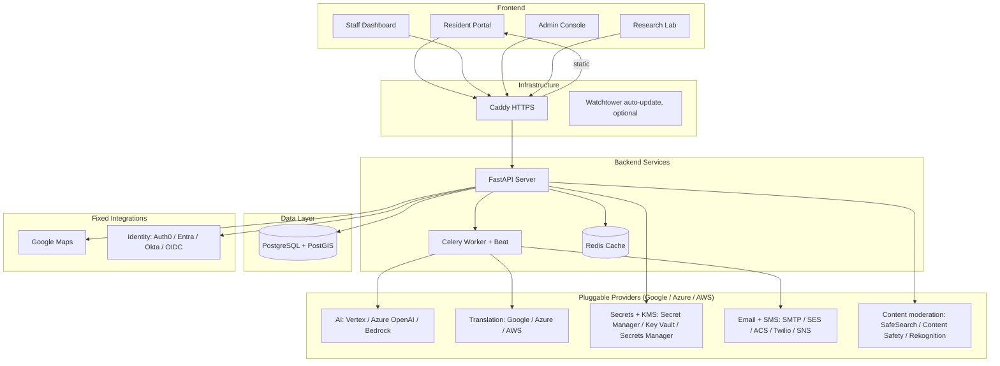
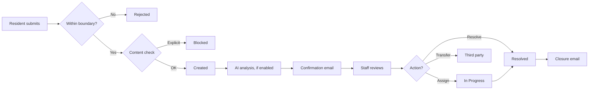
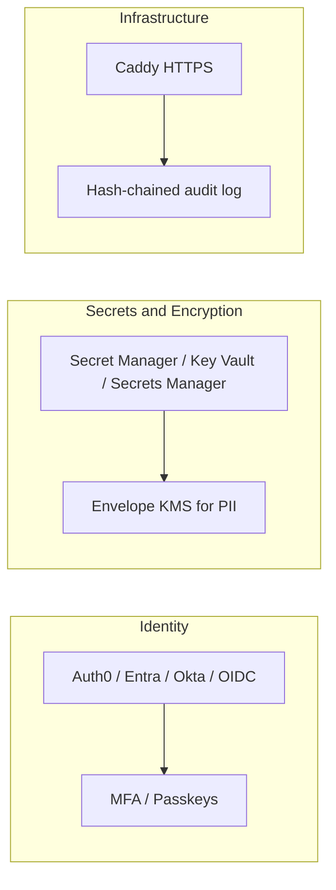

# Pinpoint 311 — Municipal Service Request Platform

<p align="center">
  
</p>
<p align="center">
  <a href="https://pinpoint311.org"></a>
  
  <a href="https://hcb.hackclub.com/pinpoint-311"></a>
  
  
  
  
  
</p>

<p align="center">
  <a href="https://github.com/Pinpoint-311/Pinpoint-311/actions/workflows/build-publish.yml"></a>
  <a href="https://github.com/Pinpoint-311/Pinpoint-311/actions/workflows/codeql.yml"></a>
  <a href="https://github.com/Pinpoint-311/Pinpoint-311/actions/workflows/security-scan.yml"></a>
  <a href="https://github.com/Pinpoint-311/Pinpoint-311/actions/workflows/accessibility.yml"></a>
</p>

## Introduction

Pinpoint 311 is an open-source platform for municipal service requests (311). Residents report issues without creating an account; staff triage, route, and resolve them from a shared dashboard; and administrators configure services, providers, and integrations without editing code.

The platform includes optional AI triage and photo analysis, geospatial routing and analytics (PostGIS), automatic translation, and connectors to common govtech systems. AI, translation, secret storage, PII encryption, email, and SMS are provider-pluggable across Google Cloud, Microsoft Azure, and AWS, and each is optional: if a provider is not configured, that feature is skipped and the rest of the system continues to run.

---

## Table of Contents

- [Why Pinpoint?](#why-pinpoint)
- [Roles](#roles)
- [Core Features Overview](#core-features-overview)
- [Resident Portal Features](#resident-portal-features)
- [Staff Dashboard Features](#staff-dashboard-features)
- [Admin Console Features](#admin-console-features)
- [Research Suite](#research-suite-university-lab-integration)
- [Technical Architecture](#technical-architecture)
- [Deployment & Setup](#deployment--setup)
- [Roadmap](#roadmap)
- [Security & Governance](#security--governance)
- [License](#license)

---

## Why Pinpoint?

### Feature Comparison

| Feature | Legacy Forms | SeeClickFix / Commercial | Pinpoint 311 |
| :--- | :---: | :---: | :---: |
| Pricing | Free (DIY) | $5–20K/year | Free and open source |
| Data ownership | You own | Vendor-hosted | Self-hosted |
| Source code | N/A | Proprietary | MIT License |
| Mobile experience | Non-responsive | Native apps | Responsive web app |
| AI triage | Manual | Basic rules | Optional, pluggable (Vertex / Azure OpenAI / Bedrock) |
| Photo analysis | None | None | Vision-model analysis (when AI configured) |
| Multilingual | English | ~10 languages | 100+ languages |
| Resident login | Required | Required | No account needed |
| Live tracking | None | Email only | SMS, email, and magic link |
| Location accuracy | Text address | GPS pin | GPS and asset selection |
| PII protection | None | Basic | Field-level encryption + envelope KMS |
| Geofencing | None | Limited | GeoJSON boundaries |
| Research export | None | Extra cost | 60+ fields, included |
| Custom branding | DIY | Limited | Full white-label |
| Operations | None | Managed | Container auto-restart, optional auto-update |

Commercial 311 platforms are typically hosted by the vendor on a per-year subscription. Pinpoint 311 is self-hosted and MIT-licensed: the municipality owns the deployment and the data, and there is no per-seat or per-request cost.

---

## Roles

The platform presents four role-specific experiences:

- Resident — report an issue without an account, in 100+ languages, and track it by magic link. See [Resident Portal Features](#resident-portal-features).
- Staff — triage, route, comment on, and resolve requests, with optional AI triage and an analytics assistant. See [Staff Dashboard Features](#staff-dashboard-features).
- Admin — configure services, branding, providers, integrations, users, and roles. See [Admin Console Features](#admin-console-features).
- Researcher — export privacy-preserved municipal data for analysis. See [Research Suite](#research-suite-university-lab-integration).

<details>
<summary><b>System Architecture</b> (click to expand)</summary>



</details>

<details>
<summary><b>Request Lifecycle</b> (click to expand)</summary>



</details>

<details>
<summary><b>Security Stack</b> (click to expand)</summary>



</details>

## Core Features Overview

### User Experience
- Responsive web app for desktop and mobile browsers.
- 100+ language support via the configured translation provider, with caching. Coverage includes UI strings, service categories, status labels, filters, priority levels, and resident-submitted content. Confirmation emails and SMS are sent in the resident's selected language.
- No-login submission for residents, with email magic-link tracking.

### Intelligence (optional)
- PII redaction: names, phones, and emails are stripped from public request logs.
- Photo analysis: when an AI provider is configured, a vision model categorizes uploaded photos (for example, distinguishing a pothole from water damage). Works with any configured provider (Vertex/Gemini, Azure OpenAI/GPT-4o, or Bedrock/Claude).
- Multilingual analysis: non-English descriptions are translated to English before analysis so staff can read every submission.
- Priority scoring (human-in-the-loop): the AI suggests a 1–10 urgency score, but it is never applied automatically. Staff explicitly accept or override it, and the decision is recorded in the audit log.

### Geospatial
- Asset selection: when map layers are configured, residents can select the specific asset (streetlight, hydrant, park zone) a report relates to.
- Boundary enforcement: requests are validated against uploaded GeoJSON boundaries with point-in-polygon checks.
- Clustering: request markers group on the map (Google Maps MarkerClusterer); backend hotspot detection uses PostGIS `ST_ClusterDBSCAN`.

---

## Resident Portal Features

The Resident Portal is the public-facing submission and tracking interface.

### 1. Service Discovery
- **Visual Grid**: Services are displayed with clear, consistent iconography (Lucide React) for instant recognition.
- **Service Categories**: Browsable catalog of all available township services.

### 2. Intelligent Location Picker
- **Interactive Map**: Google Maps integration with drag-to-set pin functionality.
- **Address Autocomplete**: Type-ahead search for local addresses.
- **Jurisdiction Boundaries**: System-level polygons (GeoJSON) define the valid service area. PINS dropped outside are auto-rejected.
- **Asset Selection**: When map layers are configured, residents can click on infrastructure assets displayed on the map (e.g., specific park zones, hydrants) and select the one related to their report.

### 3. Advanced Routing Logic
- **Road-Based Routing**: Configurable rules for state/county roads.
    - *Example*: Potholes on "Route 1" are automatically blocked with a custom message: "This road is maintained by the State DOT. Please call 555-0199."
- **Third-Party Hand-off**: Services managed by private contractors (e.g., Waste Management) show specific contact info instead of a generic form.

### 4. Submission & Tracking
- **Multi-Photo Upload**: Supports up to 3 high-res images with client-side compression.
- **Magic Link Tracking**: Users receive a unique, hash-based tracking link (e.g., `/track/req-123`) to view live status updates without creating an account.
- **Status Timeline**: clean visualization of the request journey from "Received" → "In Progress" → "Resolved" → "Closed".
- **Public Request Map**: Interactive map allowing residents to view all open and resolved requests. Features robust filtering by:
    - **Department** (Police, Public Works, etc.)
    - **Status** (Open, Closed, In Progress)
    - **Date Range**
    - **Service Type**

---

## Staff Dashboard Features

The Staff Dashboard is the operational interface for reviewing and resolving requests, protected by JWT authentication.

### 1. Unified Workspace
- **Live Feed**: Auto-refreshes every 30s; identifying "NEW" requests with badging.
- **Split-Pane View**: Independent scrolling for the request list and details panel.
- **Interactive Map**: Features "Satellite View" for precise location verification. Includes comprehensive filters for:
    - **Priority Level** (Critical, High, Normal)
    - **Department & Assigned Staff**
    - **Status & Date Range**
    - **Service Category**

### 2. Collaboration Tools
- **Internal Comments**: Private staff-only notes for coordination.
- **External Updates**: Public comments visible to residents via the tracker.
- **Staff Preferences**: Each staff member can toggle their own SMS/Email notifications.
- **Audit Log**: Immutable history of every action (status change, assignment, comment).

### 3. Request Management
- **Smart Assignment**: Auto-route to specific departments or keep in a general queue.
- **Completion Types**: Close requests as **Resolved** (with photo proof), **No Action Needed** (invalid), or **Transferred** (third-party).
- **Priority Override**: Manually escalate issues that AI might have missed.
- **Asset History**: When viewing a request attached to a physical asset (e.g., Hydrant #404), automatically shows all past history for that specific asset.
- **Status Workflow**:
    - **Open**: New request.
    - **In Progress**: Staff acknowledged and working.
    - **Resolved**: Work complete.
    - **Closed**: Final state (includes optional "Completion Photo" proof).

### 4. Triage Panel
The panel shows computed context regardless of whether AI is enabled; the AI summary and suggested priority appear only when an AI provider is configured.

- **Safety flags**: highlights potential liabilities (for example, a downed power line) from the AI assessment.
- **Proximity analysis**: checks whether the issue is near critical infrastructure (schools, hospitals, fire stations) via PostGIS, with a Nominatim (OpenStreetMap) fallback for unmapped areas. Computed without AI.
- **Sentiment**: estimates the tone of the description (neutral, frustrated, urgent) when AI is on.
- **Weather context**: fetches current weather for the location to help assess hazards. Computed without AI.
- **Pluggable AI**: the summary and photo assessment run on the configured provider (Vertex/Gemini, Azure OpenAI, or Bedrock). The model list refreshes live from the provider. If AI is off or unreachable, requests still submit and the panel shows the computed context above.
- **Similar request detection**: surfaces nearby requests within ~50m and a recent time window for staff awareness. Requests are never flagged as duplicates or deleted automatically; any action is left to staff.
- **Human-in-the-loop priority**: AI priority suggestions are stored separately and shown with an "Accept AI Priority" action. Staff must accept a score before it becomes the official priority, and the change is recorded in the audit log.
- **PostGIS Geospatial Analytics**:
    - **Hotspot Analysis**: Automatically clusters requests to identify problem areas (e.g., "Pothole Clusters" on specific roads).
    - **User Bias Detection**: Flags suspicious activity using spatial statistics (e.g., single user spamming requests in a 10m radius).
    - **Jurisdiction Verification**: Real-time point-in-polygon checks against township boundaries.

### 5. Analytics Assistant
A conversational interface, running on the configured AI provider, that lets staff ask questions about their data in natural language. It cross-references system data with the Research Suite's aggregated metrics.

- **Natural-language queries**: ask questions such as "What's our average triage time?" or "Are there gaps in our response times by area?" and get answers with specific numbers.
- **Research-Grade Context**: The AI has access to aggregated metrics from the Research Suite:

| Data Category | Metrics Available |
|---|---|
| **Social Equity** | Social Vulnerability Index (SVI), income quintile distribution, housing tenure, population density |
| **Resident Sentiment** | Average sentiment score, frustration rate, repeat report rate, prior report references |
| **Bureaucratic Friction** | Average triage time, reassignment count, off-hours submission rate, escalation rate |
| **Infrastructure** | Category breakdown (roads/pavement, lighting, stormwater, etc.) |

- **Cross-Referencing**: Connects patterns across categories—e.g., correlating response times with social vulnerability, or sentiment with seasonal trends.
- **Formatted Responses**: Outputs structured markdown with section headers, bold metrics, comparison tables, and "Key Takeaway" summaries.
- **Conversation Memory**: Maintains multi-turn context so staff can drill into follow-up questions.
- **Privacy-First**: Never exposes resident PII—all data is aggregated and sanitized before reaching the AI.
- **Clear Conversation**: One-click reset to start fresh analysis sessions.

---

## Admin Console Features

Configuration for the municipality's deployment, without editing code.

- **Custom Icons**: Select from a library of 100+ icons.
- **Routing Rules**: Assign services to specific departments (e.g., "Potholes" → "DPW").
- **SLA Definitions**: Set expected response times (e.g., "24 hours" for urgent issues).

### 1. Service Configuration
- **Granular Routing**: Configure each service category (e.g., "Pothole") to:
    - **Township Handled**: Route to internal Public Works department.
    - **Third-Party Handoff**: Direct residents to external agencies (e.g., "This road is state-maintained, please call DOT at...").
    - **Road-Based Logic**: Automatically split jurisdiction based on specific street names (e.g., "Main St" goes to County, "Elm St" stays local).
- **Custom Questions**: specific follow-up questions (e.g., "Is the dog aggressive?") for each service category to gather precise details.

### 2. System Management
- **System Updates**: One-click "Pull Updates" to fetch the latest code from GitHub and rebuild containers.
- **Custom Map Layers**: Upload **GeoJSON** files to visualize township assets (Parks, Storm Drains, Zoning Districts) directly on the staff map.
- **Domain Configuration**: Automatic HTTPS provisioning via Caddy (Let's Encrypt) for custom domains.
- **Service providers**: select and configure the AI, translation, and identity providers from the Admin Console. One "cloud environment" choice can set AI, translation, secret storage, PII encryption, email, and SMS to the same cloud (Google, Azure, or AWS). Credentials are written to the configured secret store; when an external vault is used, the database holds only a reference, not the secret.
- **Key management**: store API keys for Google Maps and other services in the configured secret store (Secret Manager, Key Vault, or AWS Secrets Manager), with an encrypted database fallback.
- **Feature modules**: toggle features such as AI analysis or SMS alerts globally from the modules panel. Disabled or unconfigured providers are skipped; the rest of the system continues to run.
- **Database Maintenance**: Tools to seed default data or flush test records.

### 3. Legal Documents & Compliance
Fully customizable legal pages with sensible defaults based on municipal 311 best practices:

- **Privacy Policy**: Customizable Markdown content explaining data collection, usage, and retention. Default covers:
  - What information is collected (email required, optional phone)
  - How data is used (service request processing and communication)
  - Data sharing with relevant departments and third parties
  - Resident rights (access, correction, deletion)
  
- **Terms of Service**: Customizable Markdown with prominent non-emergency disclaimer. Default emphasizes:
  - Non-emergency use only (911 for emergencies)
  - Acceptable use policy
  - Response time expectations
  - Liability limitations
  
- **Accessibility Statement**: Customizable Markdown covering ADA/WCAG compliance. Default includes:
  - WCAG 2.1 Level AA commitment
  - Section 508 compliance
  - Alternative submission methods (phone, email, in-person)
  - Contact information for accessibility concerns

All legal pages are editable via **Admin Console → Branding → Legal Documents**.

---

## Non-Emergency Disclaimer

Residents are informed that 311 is for non-emergency municipal services only.

### One-time acknowledgment modal
- Users must acknowledge before accessing the portal.
- Persisted in `localStorage`, so it shows once per browser.

### Persistent warning banner
- A banner at the top of the resident portal reads: "Non-Emergency Only — For police, fire, or medical emergencies, call 911."

### Legal Audit Logging
Every acknowledgment is logged to the `disclaimer_acknowledgments` table:

| Field | Description |
|-------|-------------|
| `session_id` | Unique browser session identifier |
| `ip_address` | Client IP (supports IPv4/IPv6, handles proxies) |
| `user_agent` | Browser/device information |
| `acknowledged_at` | Timestamp with timezone |
| `disclaimer_version` | Version string for tracking policy updates |

This creates a complete paper trail for legal protection if any user claims they weren't aware of the non-emergency nature of the service.

---

## Research Suite (University Lab Integration)

A privacy-preserving analytics layer for external researchers studying municipal operations, infrastructure, equity, and civic engagement. Exports 60+ fields computed from the underlying data.

### Access Control
- **Researcher Role**: Dedicated user role with read-only access to sanitized data
- **Admin Toggle**: Enable/disable via Admin Console → Modules → Research Portal
- **Audit Logging**: All data access is logged for governance compliance

### Data Exports
Two export formats optimized for different research toolchains:

| Format | Use Case | Tools |
|--------|----------|-------|
| **CSV** | Statistical analysis | Python (pandas), R, SPSS, Excel |
| **GeoJSON** | Spatial analysis | QGIS, ArcGIS, GeoPandas, Mapbox |

### Privacy Preservation
All exports are designed to protect resident privacy while enabling meaningful research:

- **PII Redaction**: Phone numbers, emails, and names are masked in descriptions
- **Address Anonymization**: House numbers removed, street names preserved (e.g., "123 Main St" → "Main Street (Block)")
- **Location Fuzzing**: Coordinates snapped to ~100ft grid (default) or exact (admin only)
- **Zone IDs**: Anonymous geographic zones (~0.5 mile cells) for clustering without revealing exact locations

---

### Research Packs (5 Specialized Domains)

#### Social Equity Pack (Sociologists)
Census data integration for equity research.

| Field | Type | Description | Source |
|-------|------|-------------|--------|
| `census_tract_geoid` | string | 11-digit FIPS code for Census joins | US Census Geocoder API |
| `social_vulnerability_index` | float (0-1) | CDC SVI (0=lowest, 1=highest) | Derived from GEOID |
| `housing_tenure_renter_pct` | float (0-1) | Renter percentage in zone | Derived from GEOID |
| `income_quintile` | int (1-5) | Anonymized income quintile | Zone-based proxy |
| `population_density` | string | low/medium/high category | Zone-based proxy |

**Suggested Analyses**: Census ACS demographic correlation, SVI vs response time regression, renter vs owner reporting rates

---

#### 🔵 Environmental Context Pack (Urban Planners)
Real historical weather data and infrastructure lifecycle analysis.

| Field | Type | Description | Source |
|-------|------|-------------|--------|
| `weather_precip_24h_mm` | float | Precipitation 24h before report | Open-Meteo Archive API ✅ |
| `weather_temp_max_c` | float | Max temperature on report day | Open-Meteo Archive API ✅ |
| `weather_temp_min_c` | float | Min temperature on report day | Open-Meteo Archive API ✅ |
| `weather_code` | int | WMO weather code (61=rain, 71=snow) | Open-Meteo Archive API ✅ |
| `nearby_asset_age_years` | float | Age of matched infrastructure | Asset properties |
| `matched_asset_attributes` | JSON | Full asset properties (pressure_psi, acres, bulb type) | GeoJSON layer ✅ |
| `season` | string | winter/spring/summer/fall | Calculated |

**Suggested Analyses**: Freeze-thaw pothole correlation, asset survival analysis, precipitation-drainage linkage

---

#### 🩷 Sentiment & Trust Pack (Political Scientists)
NLP-derived indicators of civic trust and satisfaction.

| Field | Type | Description | Source |
|-------|------|-------------|--------|
| `sentiment_score` | float (-1 to +1) | NLP sentiment (-1=angry, +1=grateful) | Word-based NLP ✅ |
| `is_repeat_report` | boolean | Text indicates prior report of same issue | Regex detection ✅ |
| `prior_report_mentioned` | boolean | References ticket/case number | Regex detection ✅ |
| `frustration_expressed` | boolean | Trust erosion indicators present | Regex detection ✅ |

**Suggested Analyses**: Sentiment vs income quintile, repeat report resolution rates, trust erosion over time

---

#### 🟠 Bureaucratic Friction Pack (Public Administration)
Quantified measures of administrative efficiency and government responsiveness.

| Field | Type | Description | Source |
|-------|------|-------------|--------|
| `time_to_triage_hours` | float | Hours from submission to first "In Progress" | Audit logs ✅ |
| `reassignment_count` | int | Times request bounced between departments | Audit logs ✅ |
| `off_hours_submission` | boolean | Submitted before 6am or after 10pm | Timestamp ✅ |
| `escalation_occurred` | boolean | Priority manually increased by staff | Audit logs ✅ |
| `total_hours_to_resolve` | float | Total clock hours to closure | Calculated ✅ |
| `business_hours_to_resolve` | float | Business hours only (Mon-Fri 8am-5pm) | Calculated ✅ |
| `days_to_first_update` | float | Days until first staff action | Calculated ✅ |
| `status_change_count` | int | Number of status changes | Audit logs ✅ |

**Suggested Analyses**: Triage time vs resolution outcome, department routing efficiency, off-hours urgent patterns

---

#### 🟢 AI/ML Research Pack (Data Scientists)
Training data for AI systems and human-AI alignment studies.

| Field | Type | Description | Source |
|-------|------|-------------|--------|
| `ai_flagged` | boolean | AI flagged for staff review | Vertex AI ✅ |
| `ai_flag_reason` | string | Reason for flag (safety, urgent) | Vertex AI ✅ |
| `ai_priority_score` | float (1-10) | AI-generated priority | Vertex AI ✅ |
| `ai_classification` | string | AI-assigned category | Vertex AI ✅ |
| `ai_summary_sanitized` | string | AI summary (PII redacted) | Vertex AI ✅ |
| `ai_analyzed` | boolean | Whether AI processed this request | System ✅ |
| `ai_vs_manual_priority_diff` | float | manual_priority - ai_priority | Calculated ✅ |

**Suggested Analyses**: AI-human priority alignment, flagging accuracy, classification accuracy studies

---

### Real-Time Data Sources
All research fields are computed on-the-fly using real APIs:

| Source | Fields | Notes |
|--------|--------|-------|
| **US Census Bureau Geocoder** | census_tract_geoid | Free, no API key required |
| **Open-Meteo Archive API** | weather_* fields | Free historical weather data |
| **NLP Analysis** | sentiment_score, trust indicators | Word-based sentiment analysis |
| **Audit Logs** | bureaucratic friction fields | Real system data |
| **Vertex AI** | ai_* fields | If AI analysis is enabled |

### API Endpoints
| Endpoint | Description |
|----------|-------------|
| `GET /api/research/status` | Check if Research Suite is enabled |
| `GET /api/research/analytics` | Aggregate statistics and distributions |
| `GET /api/research/export/csv` | Download sanitized CSV with all 60+ fields |
| `GET /api/research/export/geojson` | Download GeoJSON for GIS analysis |
| `GET /api/research/data-dictionary` | Complete field documentation for academic papers |
| `GET /api/research/code-snippets` | Python & R code examples |

---

## 🚀 Technical Architecture

### Communication Engine
- **Branding Engine**: Automatically injects township logo, colors, and font settings into every email.
- **Rich SMS**: Sends text alerts with status emojis (✅, 🚧), request details (category, address), and magic links for instant tracking.
- **Provider Agnostic**: Built-in support for **Twilio**, plus a generic HTTP adapter for any other SMS gateway.
- **Completion Proof**: "Review & Close" workflow attaches the final resolution photo to the closing email sent to the resident.

### Standards Compliance
- **Open311 v2**: Compatible with the Open311 GeoReport v2 standard (JSON).
- **Interactive API Docs**: Available at `/api/docs` (Swagger UI) and `/api/redoc` (ReDoc).
- **Audit Trails**: Every action (submission, comment, status change) is logged for accountability.

#### Public Endpoints (No Authentication Required)

| Method | Endpoint | Description | Rate Limit |
|--------|----------|-------------|------------|
| `GET` | `/api/open311/v2/services.json` | List available service categories | Global |
| `POST` | `/api/open311/v2/requests.json` | Submit a new service request | **10/min per IP** |
| `GET` | `/api/open311/v2/public/requests` | List all requests (PII stripped, cached via Redis) | Global |
| `GET` | `/api/open311/v2/public/requests/{id}` | Get request detail (PII stripped) | Global |
| `GET` | `/api/open311/v2/public/requests/{id}/comments` | Get public comments on a request | Global |
| `POST` | `/api/open311/v2/public/requests/{id}/comments` | Add a public comment (anonymous) | **5/min per IP** |
| `GET` | `/api/open311/v2/public/requests/{id}/audit-log` | Status change history (staff names redacted) | Global |

#### Authenticated Endpoints (Staff/Admin Only)

| Method | Endpoint | Description |
|--------|----------|-------------|
| `GET` | `/api/open311/v2/requests.json` | List all requests with full PII |
| `GET` | `/api/open311/v2/requests/{id}.json` | Get full request detail with PII |
| `PUT` | `/api/open311/v2/requests/{id}/status` | Update status, assignment, or priority |
| `POST` | `/api/open311/v2/requests/manual` | Create request from phone/walk-in intake |
| `DELETE` | `/api/open311/v2/requests/{id}` | Soft-delete a request (requires justification) |
| `POST` | `/api/open311/v2/requests/{id}/restore` | Restore a soft-deleted request |
| `POST` | `/api/open311/v2/requests/{id}/accept-ai-priority` | Accept AI-suggested priority score |
| `GET` | `/api/open311/v2/requests/{id}/audit-log` | Full audit log with staff names |
| `GET` | `/api/open311/v2/requests/asset/{id}/related` | Find all requests linked to an asset |

#### API Security Notes

- **Public endpoints never expose**: staff usernames, resident PII (email, phone, name), or internal department IDs
- **Staff audit log entries** in public views show "Staff" instead of individual usernames
- **Legal hold** (`flagged` field) can only be toggled by admin-role users
- **Global rate limit**: 500 requests/minute per IP across all endpoints (via SlowAPI)
- **Authentication**: Staff endpoints require a valid Auth0 JWT bearer token

### Tech Stack
| Component | Technology | Description |
|-----------|------------|-------------|
| **Frontend** | React 18 + TypeScript | Performant, type-safe UI built with Vite |
| **Styling** | Tailwind CSS + Framer Motion | Fluid animations and glassmorphism themes |
| **Backend** | FastAPI (Python 3.11) | High-performance async REST API |
| **Database** | PostgreSQL 15 + PostGIS | Relational data with advanced spatial queries |
| **Migrations** | Alembic | Version-controlled database schema changes |
| **Caching** | Redis | High-speed caching for public request feeds (60s TTL) |
| **AI** | Vertex AI (Gemini 3.1 Flash-Lite) | Multimodal model for image/text analysis |
| **Queue** | Celery + Redis | Background processing for emails and reports |
| **Reverse Proxy** | Caddy | Automatic HTTPS and SSL termination |

### 💾 Resource Footprint

The entire Pinpoint 311 stack uses **less memory than a single Chrome tab**:

| Service | CPU | Memory |
|---------|-----|--------|
| PostgreSQL (db) | ~4% | 18 MB |
| Backend (FastAPI) | <1% | 23 MB |
| Worker (Celery) | <1% | 94 MB |
| Frontend (Nginx) | <1% | 3 MB |
| Caddy (HTTPS) | ~1% | 14 MB |
| Redis | <1% | 4 MB |
| **TOTAL** | **~6%** | **~160 MB** |

> **For comparison**: A single Gmail tab uses 200-400 MB. The entire production 311 system with AI, maps, authentication, and real-time monitoring uses less than half of that.

**Deployment costs:** Runs on a free-tier cloud VM (1 vCPU, 1GB RAM) or ~$5-10/month on any cloud provider. Suitable for typical municipal workloads without additional scaling.

### 🗄️ Database Migrations (Alembic)

Pinpoint 311 uses **Alembic** for database schema versioning:

```bash
# Inside the backend container
cd /app

# Create a new migration after model changes
alembic revision --autogenerate -m "Add new column to requests"

# Apply pending migrations
alembic upgrade head

# View current migration state
alembic current
```

**Configuration Notes:**
- PostGIS/Tiger geocoder tables are **excluded** from autogenerate to prevent false positives
- Migrations are stored in `backend/alembic/versions/`
- Use `alembic stamp head` to mark an existing database as up-to-date without running migrations

### 🔒 Security Standards

#### Enterprise Security Stack
Pinpoint 311 implements a production-grade security stack with managed cloud services:

| Component | Purpose | Provider |
|-----------|---------|----------|
| **Auth0** | SSO with MFA & Passkeys | Managed Identity |
| **Google Secret Manager** | API keys & credentials | Google Cloud |
| **Google Cloud KMS** | Resident PII encryption | Google Cloud |
| **Watchtower** | Container auto-updates | Self-hosted |

#### Zero-Password Authentication
Staff login via **Auth0** with enterprise-grade security:
- **Multi-Factor Authentication**: TOTP, passkeys, and biometric support
- **Social Login**: Google, Microsoft, and other identity providers
- **Passwordless Option**: WebAuthn/passkeys for phishing resistance
- **No passwords stored**: Authentication fully delegated to Auth0

#### Secrets Management
Two-tier security for credentials:

| Secret Type | Storage | Encryption |
|-------------|---------|------------|
| API Keys (SMTP, SMS, Maps) | Google Secret Manager | Google-managed HSMs |
| Resident PII (email, phone, name) | PostgreSQL | Google Cloud KMS (AES-256) |
| Local Development | Encrypted Database | Fernet (AES-128-CBC) |


#### GCP Service Account Authentication
Pinpoint 311 uses **encrypted service account keys** for Google Cloud access:

```
┌─────────────┐    Fernet Encrypted    ┌──────────────────┐    Direct Auth    ┌─────────────┐
│   Backend   │ ─────────────────────▶ │ PostgreSQL DB    │ ────────────────▶ │ GCP APIs    │
│   (FastAPI) │                        │ (system_secrets) │                   │ SM, KMS, AI │
└─────────────┘                        └──────────────────┘                   └─────────────┘
```

**How it works:**
1. Upload service account JSON during initial setup
2. Key is encrypted with Fernet (AES-128-CBC) using `SECRET_KEY`
3. Stored securely in the `system_secrets` database table
4. Decrypted at runtime when accessing GCP services

**Bootstrap Keys:**
Two keys must remain in the local database (not migrated to Secret Manager):
- `GCP_SERVICE_ACCOUNT_JSON`: The encrypted service account key
- `GOOGLE_CLOUD_PROJECT`: The GCP project ID

These "bootstrap keys" are needed to *access* Secret Manager itself, so they must be stored locally.


#### API & Infrastructure Security
- **Rate Limiting**: 500 requests/minute per IP (slowapi)
- **Security Headers**: X-Frame-Options, CSP, nosniff, XSS protection
- **RBAC**: Staff, Researcher, Admin roles with JWT authentication
- **Input Validation**: Pydantic schemas, SQLAlchemy ORM (SQL injection proof)
- **Audit Logging**: Immutable trail of all request lifecycle events

For full security details, see [COMPLIANCE.md](./COMPLIANCE.md).

#### Vertex AI Security
| Feature | Protection |
|---------|------------|
| Data Residency | Stays within configured GCP region |
| Encryption | TLS 1.3+ in transit, AES-256 at rest |
| No Data Training | Customer data NOT used for training |
| Certifications | SOC 1/2/3, ISO 27001, FedRAMP, HIPAA |
| Human-in-the-Loop | AI suggestions require staff approval |

### 📋 Document Retention Engine

State-specific record retention with legal hold protection:
- **Built-in policies**: TX (10yr), NJ/PA/WI (7yr), NY/MI/WA/CT (6yr), CA/FL/most states (5yr), GA/MA (3yr)
- **Admin-configurable**: Select state or custom period
- **Automatic enforcement**: Daily Celery Beat task archives expired records

#### Legal Holds
Records can be placed on **legal hold** via the `flagged` field to prevent automatic archival:
- **Per-request holds**: Staff can flag individual requests from the detail view
- **Audit trail**: All flag/unflag actions are logged with timestamp and user

#### Compliance Features
| Requirement | Implementation |
|-------------|----------------|
| **OPRA (NJ) / FOIA** | Export any request's full audit trail on demand |
| **CJIS** | PII encryption at rest (AES-256) and in transit (TLS 1.3) |
| **NIST 800-53** | Immutable audit logs with tamper detection |
| **GDPR/CCPA** | PII anonymization option for closed records |
| **Records Officer** | Designated admin role for retention policy management |


### ♿ Accessibility (WCAG 2.1 AA)

Keyboard navigation, 4.5:1 contrast ratio, and aria-labels on interactive elements. See [COMPLIANCE.md](./COMPLIANCE.md) for details.

---

## 📦 Deployment & Setup

### CI/CD Pipeline

Pinpoint 311 uses GitHub Actions for automated builds and security scanning:

| Workflow | Trigger | Purpose |
|----------|---------|---------|
| **Build & Publish** | Push to main | Multi-arch Docker images to GHCR |
| **CodeQL** | Push/PR + weekly | Static security analysis (Python/JS) |
| **Security Scan** | Push to main + weekly (Sundays) | OWASP ZAP + Trivy vulnerability scanning |
| **Accessibility** | Push to main | Pa11y accessibility audits |
| **Uptime Monitor** | Every 15 min | Health checks with auto-restart |
| **Load Test** | Manual dispatch | K6 performance benchmarking |
| **Dependabot** | Weekly | Automatic dependency updates |

### Self-Healing Infrastructure

The system automatically recovers from common failures without developer intervention:

| Layer | Protection | Config Required |
|-------|------------|-----------------|
| **Docker Healthchecks** | Backend, Worker, Frontend auto-restart if unresponsive | None ✅ |
| **Container Restart** | Containers restart after crash (`unless-stopped`) | None ✅ |
| **Watchtower** | Auto-pulls security updates at 3am daily | None ✅ |
| **SSH Auto-Restart** | Force restart via SSH when uptime check fails | Optional* |

*To enable SSH auto-restart, add `PROD_HOST` and `PROD_SSH_KEY` secrets to your GitHub repository.

### Resource Isolation

Prevents the 311 system from affecting other server systems:

| Service | CPU | Memory | Log Limit |
|---------|-----|--------|-----------|
| Database | 1 core | 1GB | 150MB |
| Backend | 1 core | 1GB | 150MB |
| Worker | 0.5 core | 512MB | 60MB |
| Frontend | 1 core | 512MB | 30MB |
| Redis | 0.25 core | 256MB | 30MB |
| Caddy | 0.25 core | 128MB | 60MB |

**Safety features:** `no-new-privileges` on all containers, Redis memory eviction, process limits on database.

### Docker Images

Pre-built images available on GitHub Container Registry:
```bash
ghcr.io/pinpoint-311/pinpoint-311-backend:latest
ghcr.io/pinpoint-311/pinpoint-311-frontend:latest
```

Supports both `linux/amd64` and `linux/arm64` architectures.

### Production Deployment (Recommended)

```bash
# Pull prebuilt images and deploy
docker compose -f docker-compose.yml -f docker-compose.prod.yml pull
docker compose -f docker-compose.yml -f docker-compose.prod.yml up -d
```

### Development Deployment

```bash
# Build locally (slower, for development only)
docker compose up --build -d
```

### Prerequisites
- Docker & Docker Compose
- A Google Cloud Project (for Maps & Vertex AI)

### Quick Start (Using Prebuilt Images)
```bash
# 1. Clone the repository
git clone https://github.com/Pinpoint-311/Pinpoint-311.git
cd Pinpoint-311

# 2. Configure Environment
cp .env.example .env
# Edit .env and set your secrets (DB_PASSWORD, SECRET_KEY, etc.)

# 3. Pull prebuilt images and launch (recommended - fastest)
docker compose -f docker-compose.yml -f docker-compose.prod.yml pull
docker compose -f docker-compose.yml -f docker-compose.prod.yml up -d

# OR build locally (slower, for development/modifications)
# docker compose up --build -d
```

### Access Points (Production via Caddy)
- **Resident Portal**: `http://localhost/`
- **Staff Dashboard**: `http://localhost/staff`
- **Admin Console**: `http://localhost/admin`
- **Research Lab**: `http://localhost/research` *(requires researcher role)*
- **API Documentation**: `http://localhost/api/docs`

> [!TIP]
> In development without Caddy, the frontend runs at `http://localhost:5173` and the API at `http://localhost:8000`.

### Initial Setup & Authentication

Pinpoint 311 uses **Auth0 SSO** for all staff authentication.

#### Step 1: Configure Environment
```bash
cp .env.example .env
# Edit .env:
#   - DB_PASSWORD: Set a secure database password
#   - SECRET_KEY: Generate with `openssl rand -base64 32`
#   - DOMAIN: Your production domain (e.g., 311.yourtown.gov)
```

#### Step 2: Start Services
```bash
docker compose up -d
```

#### Step 3: Get Bootstrap Access
Before Auth0 is configured, use the bootstrap endpoint:
```bash
curl -X POST http://localhost/api/auth/bootstrap
```
Click the returned magic link → logs you into Admin Console.

#### Step 4: Configure Auth0 via Setup & Integration
In Admin Console → Setup & Integration:
1. Enter Auth0 domain, client ID, client secret
2. System encrypts and stores credentials securely
3. Bootstrap access is automatically disabled

#### Step 5: (Optional) Enable Google Secret Manager
For enterprise-grade secret storage, configure GCP in the Setup & Integration page. Secrets will be migrated from the database to Google Secret Manager.

#### Step 6: (Optional) Enable 45° Map Tilt & Rotation
For an immersive bird's eye map experience with 3D buildings, configure a **Google Maps Map ID**:

1. Go to [Google Cloud Console → Maps → Map Management](https://console.cloud.google.com/google/maps-apis/studio/maps)
2. Click **Create Map ID**
3. Select **Map type: Vector** and give it a name (e.g., "Pinpoint 311")
4. Copy the generated Map ID
5. In Admin Console → Secrets, add the key `GOOGLE_MAPS_MAP_ID` with the Map ID value

> [!TIP]
> Map ID enables the WebGL renderer with 45° tilt, compass rotation, and 3D buildings at no extra cost — same Dynamic Maps pricing ($7/1,000 loads, $200/month free credit).

### Security Storage

| Secret | Default Storage | Enterprise Storage |
|--------|-----------------|-------------------|
| DB Password | `.env` file | `.env` file |
| JWT Secret Key | `.env` file | `.env` file |
| Auth0 Credentials | Database (Fernet encrypted) | Google Secret Manager |
| API Keys | Database (Fernet encrypted) | Google Secret Manager |

> [!NOTE]
> Bootstrap access is automatically disabled once Auth0 is configured. All future logins use SSO.

---

## 🛡️ Security & Governance

Pinpoint 311 is designed for municipal government use, handling sensitive resident data. We take security, privacy, and supply-chain integrity seriously.

### 🔒 Reporting Vulnerabilities

**DO NOT** file a public issue for security vulnerabilities. Publicly disclosing a vulnerability puts live deployments at risk.

We use GitHub's **Private Vulnerability Reporting** to handle disclosures securely:

1. Go to the [**Security** tab](https://github.com/Pinpoint-311/Pinpoint-311/security) in this repository.
2. Click on **"Report a vulnerability"** to open a private advisory.
3. Describe the vulnerability. This opens a private communication channel visible *only* to the project maintainers.

We aim to acknowledge all reports within 48 hours.

### 🏗️ Zero-Trust Governance Model

To maintain the integrity required for government software:

| Access Type | Policy |
|-------------|--------|
| **Read Access** | Code is open-source and auditable by anyone |
| **Write Access** | Merge rights restricted to Core Maintainers only |
| **Review Process** | All PRs undergo mandatory security review before merging |
| **Dependencies** | All dependencies pinned to specific versions to prevent supply-chain attacks |

### ✅ Supported Versions

| Version | Supported | Notes |
| :--- | :---: | :--- |
| **Latest Stable** | ✅ | Current production release |
| **Main Branch** | ⚠️ | Development builds (unstable) |
| **< 1.0.0** | ❌ | Legacy versions |

### 🛑 Out of Scope

The following are generally considered out of scope for security reports:
- Attacks requiring physical access to the user's device
- Social engineering attacks against staff
- Clickjacking on pages with no sensitive actions
- Reports from automated scanners without validated proof of concept

---

## 🔄 Sustainability & Continuity

**Can this system stand on its own if Pinpoint 311 disappears tomorrow?**

**Yes.** Every deployment is 100% self-hosted on YOUR infrastructure.

| Aspect | Status |
|--------|--------|
| **Code Ownership** | ✅ Full source code on your server |
| **Data Ownership** | ✅ PostgreSQL database you control |
| **License** | ✅ MIT - fork, modify, redistribute freely |
| **Dependencies** | ✅ All open-source with public documentation |
| **Phone-Home** | ✅ None - no calls to Pinpoint 311 servers |
| **Self-Healing** | ✅ Auto-restart, health checks |
| **Watchtower** | ✅ Optional auto-updates (see below) |

**Watchtower (Optional):**
Watchtower automatically updates your Docker containers with security patches. It runs at 3am daily.

```bash
# Enable Watchtower
docker compose up -d watchtower

# Disable Watchtower  
docker compose stop watchtower

# Check status
docker compose ps watchtower
```

> 💡 The core system works perfectly without Watchtower. Enable it for hands-off security updates, or disable it for full manual control.

**What you'd handle independently:**
- Security patches for dependencies
- New features and bug fixes
- Any developer familiar with Python/FastAPI + React can maintain this codebase

---

## 📄 License

Pinpoint 311 is open-source software licensed under the [MIT License](LICENSE).

---

## 🤝 Fiscal Sponsorship

Pinpoint 311 is fiscally sponsored by **[The Hack Foundation](https://hackclub.com/fiscal-sponsorship/)** (d.b.a. Hack Club), a 501(c)(3) public charity (EIN: 81-2908499). Hack Club provides fiscal sponsorship infrastructure, allowing Pinpoint 311 to receive tax-deductible donations on our behalf while we focus on building civic technology.

Donations to Pinpoint 311 are tax-deductible to the extent permitted by law.

<p align="center">
  Built by Pinpoint 311 for Civic Engagement<br>
  <a href="https://hcb.hackclub.com/pinpoint-311"></a>
</p>
