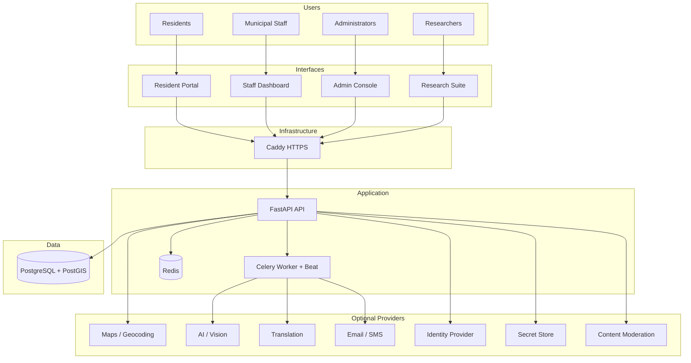
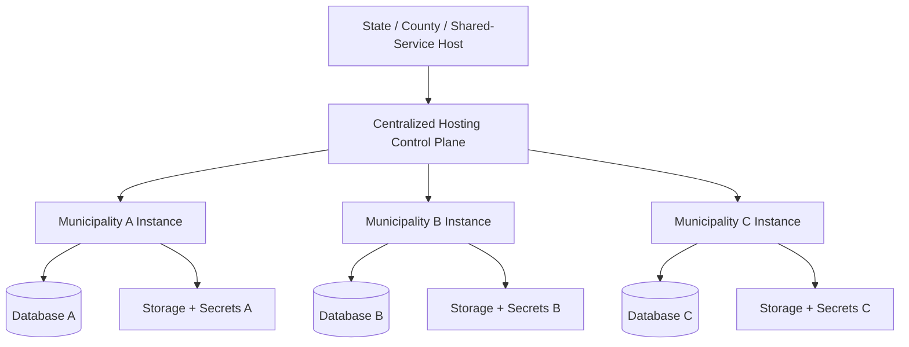
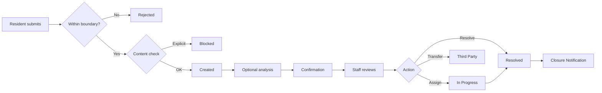
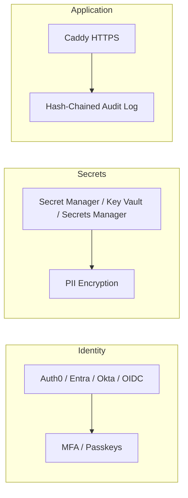

# Pinpoint 311

<p align="center">
  
</p>

<p align="center">
  <strong>Free, open-source municipal service request software for residents, staff, administrators, and researchers.</strong>
</p>

<p align="center">
  <a href="https://pinpoint311.org"></a>
  
  <a href="https://hcb.hackclub.com/pinpoint-311"></a>
  
  
  
</p>

---

## Overview

Pinpoint 311 is a free, open-source platform for managing non-emergency municipal service requests.

Residents can report issues without creating an account. Staff can route, assign, update, and resolve requests from a central dashboard. Administrators can configure services, departments, integrations, branding, routing, and system settings from the browser. Researchers can work with privacy-preserved operational and geographic data through an optional Research Suite.

Municipalities can operate independent self-hosted instances, while states, counties, shared-service organizations, and other hosts can optionally operate isolated municipal instances through Pinpoint's centralized-hosting system.

Pinpoint is MIT licensed. Each municipal instance maintains its own data and configuration, with no per-seat or per-request software licensing fees.

### At a glance

- No resident account required
- Mobile-friendly resident reporting
- 100+ language support through configurable translation providers
- Photo and map-based submissions
- Department, jurisdiction, and road-based routing
- Staff request-management dashboard
- Browser-based administration
- Email and SMS notifications
- Open311 GeoReport v2 support
- PostgreSQL + PostGIS geospatial processing
- Optional AI-assisted triage and analytics
- Privacy-preserving research and data exports
- Standalone municipal or centralized multi-municipality hosting
- Docker-based deployment
- MIT licensed

---

## Contents

### Who Pinpoint Is For

- [For Residents](#for-residents)
- [For Staff](#for-staff)
- [For Administrators](#for-administrators)
- [For Researchers](#for-researchers)

### Platform

- [GIS and Jurisdiction Routing](#gis-and-jurisdiction-routing)
- [Optional AI Assistance](#optional-ai-assistance)
- [Privacy and Security](#privacy-and-security)
- [Open311 and Integrations](#open311-and-integrations)
- [Accessibility](#accessibility)
- [Architecture](#architecture)

### Deployment

- [Deployment Models](#deployment-models)
- [Municipal Self-Hosting](#municipal-self-hosting)
- [Quick Start](#quick-start)
- [Initial Setup](#initial-setup)
- [Centralized Hosting](#centralized-hosting)
- [Updates and Backups](#updates-and-backups)

### Project

- [Reporting Security Issues](#reporting-security-issues)
- [Contributing](#contributing)
- [License](#license)
- [Fiscal Sponsorship](#fiscal-sponsorship)

### Technical Reference

- [Request Lifecycle](#request-lifecycle)
- [Resident Portal Reference](#resident-portal-reference)
- [Staff Dashboard Reference](#staff-dashboard-reference)
- [Admin Console Reference](#admin-console-reference)
- [Research Data Dictionary](#research-data-dictionary)
- [API Reference](#api-reference)
- [Resource Requirements and Sizing](#resource-requirements-and-sizing)
- [Database Migrations](#database-migrations)
- [Security Implementation Details](#security-implementation-details)
- [Records Retention Implementation](#records-retention-implementation)
- [CI/CD Reference](#cicd-reference)
- [Infrastructure and Container Configuration](#infrastructure-and-container-configuration)
- [Authentication and Provider Setup](#authentication-and-provider-setup)
- [Sustainability and Continuity](#sustainability-and-continuity)

---

# Who Pinpoint Is For

## For Residents

Pinpoint gives residents a simple way to report non-emergency problems without creating an account or learning how municipal departments are organized.

A resident can report an issue, place it on a map, attach photos, answer questions specific to the service, and provide contact information for updates.

### Simple reporting

Residents can:

- Select a service category
- Enter or select a location on a map
- Upload up to three photos
- Answer service-specific questions
- Provide contact information for updates
- Submit an unlisted request
- Submit without creating an account

### Track without an account

After submitting a request, residents can receive a secure magic link for tracking it.

The tracking page can show:

- Current status
- Public updates
- Status history
- Resolution information
- Completion photos
- Resident comments

Email and SMS notifications can also be enabled.

### Map-based reporting

Pinpoint can use configured mapping and GIS providers to help residents identify exactly where a problem is located.

Supported mapping integrations include:

- Google Maps
- Esri / ArcGIS Online and Enterprise
- Azure Maps
- Apple MapKit JS

Municipalities can also add their own infrastructure layers, allowing residents to select assets such as hydrants, streetlights, parks, or other mapped infrastructure.

### Public request map

Municipalities can provide a public map and feed of service requests.

Residents can filter public requests by:

- Service
- Department
- Status
- Date
- Location

Resident PII is excluded from public views.

### Language access

Pinpoint supports configurable translation providers, allowing the resident interface to be offered in more than 100 languages.

Translation is optional and can be configured by the municipality.

---

## For Staff

Pinpoint gives municipal employees a central workspace for receiving, triaging, assigning, updating, and resolving service requests.

Staff do not need residents to know which department handles a problem. Routing rules and municipal configuration can direct requests to the appropriate workflow.

### Request management

Staff can:

- Review incoming requests
- Search and filter the request queue
- Assign requests to departments or individual staff
- Update status and priority
- Add internal notes
- Send public updates
- Transfer requests
- Resolve or close requests
- Attach completion photos
- Generate printable work orders
- Review infrastructure asset history
- View request audit history

### Manual intake

Not every resident reports an issue online.

Staff can create requests on behalf of residents who contact the municipality through:

- Phone
- Email
- Walk-in service

Manually entered requests use the same routing, status, notification, and reporting workflows as online submissions.

### Routing

Requests can be routed using configurable rules based on:

- Service category
- Department
- Geographic location
- Road jurisdiction
- Infrastructure asset
- External agency responsibility

For example, a pothole on a municipal road can enter the municipality's Public Works queue while a report on a state-maintained highway can instead direct the resident toward the appropriate outside agency.

### Operational context

Staff can see additional context around a request, including:

- Nearby requests
- Infrastructure information
- Geographic context
- Request history
- Status history
- Assignment history
- Optional AI-assisted triage

This keeps operational information attached to the request instead of scattered across email, spreadsheets, and separate systems.

---

## For Administrators

Pinpoint gives municipal administrators control over how the platform operates without requiring routine code changes.

The Admin Console is used to configure the municipality's services, departments, routing, branding, users, providers, infrastructure layers, and optional modules.

### Services and departments

Administrators can configure:

- Service categories
- Departments
- Department routing
- Road-based routing
- Third-party handoffs
- Custom service questions
- Expected service levels
- Infrastructure layers

### Municipal branding

Each deployment can use the municipality's:

- Name
- Logo
- Colors
- Domain
- Legal documents
- Service catalog

### Users and access

Pinpoint supports role-based access for:

- Staff
- Administrators
- Researchers

Staff authentication can be provided through:

- Auth0
- Microsoft Entra ID
- Okta
- Generic OIDC providers

### Integrations

Administrators can configure providers for:

- Maps
- Geocoding
- Translation
- AI
- Photo processing
- Email
- SMS
- Identity
- Secret storage

Advanced integrations are optional. The core service-request workflow can operate without AI, translation, or external messaging providers.

### Infrastructure layers

Administrators can upload GeoJSON layers representing municipal assets such as:

- Parks
- Storm drains
- Hydrants
- Streetlights
- Zoning districts
- Other infrastructure

These layers can be used for resident reporting, staff context, routing, and infrastructure history.

### Records administration

Pinpoint includes configurable tools for:

- Records retention
- Anonymization
- Legal holds
- Audit history
- Request deletion and restoration workflows

Retention policies can be configured according to the municipality's applicable records requirements.

### Deployment control

Municipalities can run Pinpoint independently on their own infrastructure.

Organizations operating Pinpoint for multiple municipalities can instead use the optional centralized-hosting architecture, which allows a state, county, shared-service organization, or other host to manage isolated municipal instances from a central control plane.

More information is available in [Centralized Hosting](#centralized-hosting).

---

## For Researchers

Pinpoint includes an optional Research Suite for studying municipal service delivery while separating research data from direct resident identifying information.

The Research Suite can be enabled or disabled by the municipality.

### Municipal analytics

Researchers and authorized municipal users can study:

- Request volume
- Response and resolution times
- Reassignment patterns
- Service hotspots
- Infrastructure history
- Seasonal trends
- Resident sentiment
- Geographic patterns
- Administrative workflow
- Human/AI decision patterns

### Privacy-preserved exports

Authorized researchers can export sanitized datasets in:

- CSV
- GeoJSON

Research fields can include:

- Operational metrics
- Geographic variables
- Infrastructure context
- Census-linked variables
- Weather
- Sentiment
- Administrative-friction measures
- Human/AI comparison metrics

Resident free-text descriptions and direct identifying information are excluded from research exports.

### Reproducible analysis

The Research Suite provides a structured data dictionary and export formats intended for tools such as:

- Python
- R
- SPSS
- Excel
- QGIS
- ArcGIS
- GeoPandas

A detailed field-level reference is available in the [Research Data Dictionary](#research-data-dictionary).

---

# Platform

## GIS and Jurisdiction Routing

Pinpoint uses PostgreSQL and PostGIS for geospatial processing.

Supported workflows include:

- Point-in-polygon municipal boundary validation
- Road-corridor checks
- Infrastructure asset matching
- Nearby-request detection
- Hotspot analysis
- Geographic filtering
- Custom GeoJSON layers

This makes it possible to route requests based on where an issue actually occurs rather than relying only on the category selected by the resident.

### Road jurisdiction

Road-corridor routing can distinguish between roads maintained by different jurisdictions.

A municipality can configure Pinpoint to recognize responsibility such as:

- Municipal
- County
- State
- Utility
- Other outside agency

This allows requests outside municipal responsibility to be handled differently from ordinary municipal requests.

---

## Optional AI Assistance

AI functionality in Pinpoint is optional and provider-configurable.

When enabled, it can assist staff with:

- Plain-language request summaries
- Photo categorization
- Suggested priority scores
- Safety context
- Sentiment analysis
- Natural-language operational analytics

AI functions as decision support.

Suggested priorities require explicit staff acceptance before changing the request, and that action is recorded in the audit history.

Routing, assignment, request submission, and the core service-request workflow continue to operate when AI is disabled or unavailable.

### Photo privacy

Pinpoint supports configurable photo processing for:

- Human face detection and redaction
- License-plate detection and redaction
- EXIF metadata removal
- Photo categorization

Photos with uncertain detections can be held for staff review before publication.

---

## Privacy and Security

Pinpoint is designed for municipal environments that handle resident information.

Security and privacy features include:

- TLS in transit
- Encryption of resident PII at rest
- Role-based access control
- Staff SSO
- External secret-store support
- Public/private data separation
- PII redaction from public interfaces
- Photo redaction
- EXIF metadata removal
- Rate limiting
- Input validation
- Tamper-evident audit logging
- Configurable records retention
- Administrative legal holds
- Dependency and container security scanning

### Secret storage

Pinpoint can integrate with:

- Google Secret Manager
- AWS Secrets Manager
- Azure Key Vault

When an external secret store is configured, integration credentials can be stored there while Pinpoint retains only the reference required to retrieve them.

### PII encryption

Resident identifying information can be encrypted separately from ordinary operational request data.

### Audit history

Request lifecycle events are recorded in a tamper-evident audit history, including actions such as:

- Status changes
- Assignment changes
- Priority changes
- Comments
- Legal-hold changes
- Acceptance of AI recommendations

For additional information, see [COMPLIANCE.md](./COMPLIANCE.md).

---

## Open311 and Integrations

Pinpoint supports the **Open311 GeoReport v2** standard.

This provides standardized service discovery and request interfaces for integrations with other civic systems.

Pinpoint also supports connectors for external systems with documented APIs. Connectors can exchange request information, status updates, comments, and related data where supported by the external system.

Interactive API documentation is available in development environments at:

- `/api/docs`
- `/api/redoc`

---

## Accessibility

Pinpoint is developed toward **WCAG 2.1 Level AA**, including support for:

- Keyboard navigation
- Accessible labels
- Contrast requirements
- Screen-reader-compatible interface elements

Accessibility information and testing details are maintained in [COMPLIANCE.md](./COMPLIANCE.md).

---

## Architecture


```mermaid
graph TB
    subgraph Users
        Residents[Residents]
        Staff[Municipal Staff]
        Admins[Administrators]
        Researchers[Researchers]
    end

    subgraph Interfaces
        ResidentPortal[Resident Portal]
        StaffDashboard[Staff Dashboard]
        AdminConsole[Admin Console]
        ResearchSuite[Research Suite]
    end

    subgraph Application
        API[FastAPI API]
        Worker[Celery Worker + Beat]
        Redis[(Redis)]
    end

    subgraph Data
        Database[(PostgreSQL + PostGIS)]
    end

    subgraph Infrastructure
        Caddy[Caddy HTTPS]
    end

    subgraph Optional Providers
        Maps[Maps / Geocoding]
        AI[AI / Vision]
        Translation[Translation]
        Messaging[Email / SMS]
        Identity[Identity Provider]
        Secrets[Secret Store]
        Moderation[Content Moderation]
    end

    Residents --> ResidentPortal
    Staff --> StaffDashboard
    Admins --> AdminConsole
    Researchers --> ResearchSuite

    ResidentPortal --> Caddy
    StaffDashboard --> Caddy
    AdminConsole --> Caddy
    ResearchSuite --> Caddy

    Caddy --> API

    API --> Database
    API --> Redis
    API --> Worker

    API --> Maps
    API --> Identity
    API --> Secrets
    API --> Moderation

    Worker --> AI
    Worker --> Translation
    Worker --> Messaging
```

### Technology stack

| Component | Technology |
|---|---|
| Frontend | React 18 + TypeScript |
| Backend | FastAPI / Python |
| Database | PostgreSQL + PostGIS |
| Cache | Redis |
| Background processing | Celery |
| Database migrations | Alembic |
| Reverse proxy / HTTPS | Caddy |
| Deployment | Docker Compose |

---

# Deployment Models

Pinpoint supports two deployment models.

### Municipal self-hosting

A municipality operates its own independent Pinpoint instance and infrastructure.

### Centralized hosting

A state, county, shared-service organization, or other host operates isolated municipal instances through a central control plane.

Self-hosting is the default. Centralized hosting is optional.

---

## Municipal Self-Hosting

A municipality can run Pinpoint entirely on its own infrastructure.

Each deployment maintains its own:

- Application
- PostgreSQL/PostGIS database
- File storage
- Encryption configuration
- Secrets
- Staff accounts
- Municipal configuration
- Resident data

The municipality controls its deployment and data and does not depend on a centralized Pinpoint service for normal operation.

### Prerequisites

- Docker
- Docker Compose
- A supported mapping provider

AI, translation, email, SMS, external secret storage, and other advanced integrations are optional.

---

## Quick Start

### 1. Clone the repository

```bash
git clone https://github.com/Pinpoint-311/Pinpoint-311.git
cd Pinpoint-311
```

### 2. Configure the environment

```bash
cp .env.example .env
```

Edit `.env` and configure the required values, including a database password and application secret.

### 3. Start Pinpoint

Using prebuilt production images:

```bash
docker compose -f docker-compose.yml -f docker-compose.prod.yml pull
docker compose -f docker-compose.yml -f docker-compose.prod.yml up -d
```

For local development:

```bash
docker compose up --build -d
```

### 4. Open the application

| Interface | Path |
|---|---|
| Resident Portal | `/` |
| Staff Dashboard | `/staff` |
| Admin Console | `/admin` |
| Research Suite | `/research` |

In development mode, API documentation is available at `/api/docs` and `/api/redoc`.

---

## Initial Setup

Before staff SSO is configured, an administrator can use bootstrap authentication to access initial setup.

Configure the required environment variables:

```env
DB_PASSWORD=...
SECRET_KEY=...
INITIAL_ADMIN_PASSWORD=...
DOMAIN=311.yourtown.gov
```

Start the services:

```bash
docker compose up -d
```

Then visit:

```text
/login
```

Use the initial administrator option to enter the bootstrap password.

After signing in, use **Admin Console → Setup & Integration** to configure:

- Staff identity provider
- Mapping provider
- Email and SMS
- Translation
- AI
- Photo processing
- Secret storage
- Municipal branding
- Service categories and routing

Once staff SSO is configured, normal staff authentication uses the configured identity provider.

---

## Centralized Hosting

Pinpoint's centralized-hosting system allows an organization to operate separate Pinpoint instances for multiple municipalities from a central control plane.

This deployment model is intended for organizations such as:

- State agencies
- Counties
- Shared-service programs
- Regional authorities
- Other organizations operating Pinpoint on behalf of multiple municipalities

The centralized-hosting implementation is maintained in a separate repository:

**[Pinpoint 311 Centralized Hosting](https://github.com/Pinpoint-311/centralizedhosting/tree/main)**

### One municipality, one instance

Centralized hosting does not place every municipality into one shared resident-request database.

Each municipality continues to receive an isolated Pinpoint instance with its own:

- Application
- Database
- Storage
- Encryption keys
- Secrets
- Users
- Configuration
- Resident requests

Resident data from one municipality is not combined with resident data from another municipality.


```mermaid
graph TB
    Host[State / County / Shared-Service Host]
    Control[Centralized Hosting Control Plane]

    Host --> Control

    Control --> TownA[Municipality A Instance]
    Control --> TownB[Municipality B Instance]
    Control --> TownC[Municipality C Instance]

    TownA --> DBA[(Database A)]
    TownB --> DBB[(Database B)]
    TownC --> DBC[(Database C)]

    TownA --> SA[Storage + Secrets A]
    TownB --> SB[Storage + Secrets B]
    TownC --> SC[Storage + Secrets C]
```

### Control plane

The centralized-hosting system handles infrastructure-level fleet operations such as:

- Provisioning municipal instances
- Infrastructure configuration
- Domain and deployment configuration
- Platform-managed settings
- Version rollout
- Instance health monitoring
- Lifecycle management
- Fleet-level operational metadata

Municipal staff continue to work inside their municipality's own Pinpoint instance.

### Municipal data isolation

The control plane manages infrastructure rather than combining municipal service-request databases.

Resident activity remains within each municipality's instance.

This allows a host organization to manage infrastructure across many municipalities while preserving separate municipal deployments.

### Managed configuration

Centralized deployments can provide host-managed configuration to municipal instances.

A host can centrally provide infrastructure or integration settings while allowing each municipality to retain its own:

- Service categories
- Departments
- Routing rules
- Branding
- Staff
- Municipal content

Host-controlled settings can be identified as managed settings within the municipal Admin Console.

### Fleet updates and monitoring

Municipal instances can expose health and version information to the centralized-hosting system for:

- Health monitoring
- Version tracking
- Application rollouts
- Instance lifecycle operations

This allows the host to maintain multiple isolated deployments without administering every server individually.

### Optional by design

Centralized hosting is not required for Pinpoint.

When managed mode is disabled, Pinpoint operates as a standalone municipal deployment.

A self-hosting municipality does not need the centralized-hosting repository or control plane to operate its instance.

---

## Updates and Backups

Pinpoint updates are deliberate rather than unattended.

Administrators can update a standalone deployment through the Admin Console or Docker Compose.

### Docker Compose

```bash
docker compose pull
docker compose -f docker-compose.yml -f docker-compose.prod.yml up -d
```

Pinpoint uses Alembic for database schema migrations.

Deployments should maintain regular database backups and create a backup before significant upgrades.

Centralized deployments can coordinate application versions through the centralized-hosting control plane.

---

## Reporting Security Issues

**Please do not file public issues for security vulnerabilities.**

Use the repository's private vulnerability-reporting process so security issues can be investigated before public disclosure.

1. Open the repository's **Security** tab.
2. Select **Report a vulnerability**.
3. Submit the vulnerability through the private advisory.

---

## Contributing

Contributions are welcome.

Useful contributions include:

- Bug fixes
- Accessibility improvements
- Documentation
- Integrations
- Testing
- Performance improvements
- Municipal workflow improvements
- New service-management capabilities

For substantial changes, please open an issue first so the implementation can be discussed and coordinated.

---

## License

Pinpoint 311 is open-source software licensed under the [MIT License](LICENSE).

You may use, modify, fork, and redistribute the software under the terms of that license.

---

## Fiscal Sponsorship

Pinpoint 311 is fiscally sponsored by **[The Hack Foundation](https://hackclub.com/fiscal-sponsorship/)**, doing business as Hack Club, a 501(c)(3) public charity.

Fiscal sponsorship allows Pinpoint 311 to receive charitable contributions through Hack Club while continuing development of free and open-source civic technology.

<a href="https://hcb.hackclub.com/pinpoint-311">
  
</a>

---

# Technical Reference

The sections below provide detailed implementation, operational, API, security, and research information for developers, system administrators, security reviewers, and researchers.

They are not required to understand Pinpoint at a high level.

---

## Request Lifecycle


```mermaid
flowchart LR
    A[Resident submits] --> B{Within boundary?}
    B -->|No| C[Rejected]
    B -->|Yes| M{Content check}
    M -->|Explicit| C2[Blocked]
    M -->|OK| D[Created]

    D --> E[Optional analysis]
    E --> F[Confirmation]

    F --> G[Staff reviews]
    G --> H{Action}

    H -->|Assign| I[In Progress]
    H -->|Resolve| J[Resolved]
    H -->|Transfer| K[Third Party]

    I --> J
    J --> L[Closure Notification]
```

---

# Resident Portal Reference

## Service Discovery

Services are displayed using the municipality's configured service catalog.

Each service can have:

- A name and description
- Department assignment
- Icon
- Custom questions
- Routing behavior
- Expected service level
- Third-party handling rules

## Location Picker

The resident portal supports interactive location selection.

Depending on configured providers, this can include:

- Drag-to-set map pins
- Address autocomplete
- Google Places
- ArcGIS locators
- Municipal boundary validation
- PostGIS road-corridor checks
- Selectable infrastructure assets

## Photos

Residents can upload up to three photos.

Configured photo processing can:

- Compress uploads
- Strip EXIF metadata
- Detect and redact faces
- Detect and redact license plates
- Hold uncertain detections for staff review

## Unlisted Submissions

Residents can choose to prevent a request from appearing on the public request map or feed.

## Feedback

Municipalities can enable an optional five-point feedback survey following request submission.

## Magic-Link Tracking

Residents receive a unique tracking link that allows them to view request status without maintaining an account.

## Status Timeline

Requests can progress through states including:

- Received
- In Progress
- Resolved
- Closed

## Public Request Map

Public requests can be filtered by:

- Department
- Status
- Date range
- Service type

---

# Staff Dashboard Reference

## Unified Workspace

The staff interface provides:

- Auto-refreshing request feed
- New-request indicators
- Split-pane request/detail interface
- Interactive map
- Satellite map view
- Search and filtering

Filters can include:

- Priority
- Department
- Assigned staff
- Status
- Date range
- Service category

## Collaboration

Staff can use:

- Internal staff-only comments
- Resident-facing updates
- Individual email/SMS notification preferences
- Request audit history

## Request Management

Staff can:

- Assign requests
- Change status
- Change priority
- Resolve requests
- Mark requests as requiring no action
- Transfer requests
- Attach completion photos
- Generate printable work orders
- Place records on legal hold
- Review held photos
- Review asset history

## Work Orders

Printable work orders can include:

- Request information
- Address
- Map overview
- Dispatch notes
- QR tracking code

## Triage Panel

The triage panel combines deterministic operational context with optional AI assistance.

Context can include:

- Safety flags
- Proximity to critical infrastructure
- Weather
- Similar nearby reports
- Sentiment
- Suggested priority
- Request summary

### Proximity analysis

PostGIS can determine whether a request is near infrastructure such as:

- Schools
- Hospitals
- Fire stations

A Nominatim/OpenStreetMap fallback can provide additional context for unmapped areas.

### Similar-request detection

Nearby reports within a configurable geographic and temporal window can be surfaced for staff awareness.

Pinpoint does not automatically delete or merge reports identified as similar.

### Priority assistance

When AI is enabled, it can generate a suggested priority score.

The suggestion is stored separately from the actual request priority. A staff member must explicitly accept the suggestion before it changes the request.

## Geospatial Analytics

PostGIS supports:

- Hotspot clustering
- Spatial pattern analysis
- Jurisdiction verification
- Nearby-request analysis

## Analytics Assistant

The optional Analytics Assistant allows staff to ask natural-language questions about municipal request data.

Examples include:

- "What's our average triage time?"
- "Which service categories have the longest resolution times?"
- "Are there geographic differences in response times?"

The assistant can use aggregated Research Suite metrics rather than exposing resident PII.

## Manual Intake

Staff can create requests originating from:

- Phone calls
- Walk-ins
- Email

The intake channel is recorded for reporting.

Optional fields can remain empty when information is unavailable.

---

# Admin Console Reference

## Service Configuration

Each service can be configured with:

- Department
- Routing rules
- Third-party handoff
- Road-based jurisdiction logic
- Custom questions
- SLA expectations
- Icon

## System Management

Administrative tools include:

- Version switching
- Database backups
- Demonstration-data seeding
- Test-data cleanup
- Custom map layers
- Provider configuration
- Domain configuration
- Feature modules
- Operations monitoring
- Client-error telemetry

## Version Switching

The Admin Console can support application version changes and rollbacks.

The workflow can:

- Review available versions
- Check build/security status
- Evaluate database migration safety
- Create pre-migration backups
- Apply a selected version
- Roll back when appropriate

## Custom Map Layers

Administrators can upload GeoJSON layers representing municipal assets such as:

- Parks
- Storm drains
- Hydrants
- Streetlights
- Zoning districts
- Other infrastructure

## Providers

The Admin Console can configure:

- AI
- Translation
- Mapping
- Photo redaction
- Identity
- Email
- SMS
- Secret storage

## Feature Modules

Optional modules include:

- Research Portal
- Unlisted Reports
- Platform Feedback

## Legal Documents

Municipalities can customize:

- Privacy Policy
- Terms of Service
- Accessibility Statement

These pages are editable through the Admin Console.

---

# Research Data Dictionary

The Research Suite provides privacy-preserved operational data for municipal analysis and external research.

## Access Control

- **Researcher role:** read-only access to sanitized research data
- **Admin toggle:** enable or disable the Research Portal
- **Audit logging:** research-data access is recorded

## Export Formats

| Format | Use Case | Common Tools |
|---|---|---|
| CSV | Statistical analysis | Python, R, SPSS, Excel |
| GeoJSON | Spatial analysis | QGIS, ArcGIS, GeoPandas, Mapbox |

## Privacy Preservation

Research exports are designed to avoid direct resident identification.

Protections include:

- Exclusion of resident descriptions and free-text summaries
- Description word count instead of raw text
- Address anonymization
- Location fuzzing
- Anonymous geographic zone IDs
- Exclusion of direct resident PII

## Social Equity Pack

Census-linked fields support geographic and equity analysis.

| Field | Type | Description | Source |
|---|---|---|---|
| `census_tract_geoid` | string | 11-digit FIPS code for Census joins | US Census Geocoder API |
| `social_vulnerability_index` | float (0-1) | Social Vulnerability Index | Derived from GEOID |
| `housing_tenure_renter_pct` | float (0-1) | Renter percentage in zone | Derived from GEOID |
| `income_quintile` | int (1-5) | Anonymized income quintile | Zone-based proxy |
| `population_density` | string | Low/medium/high category | Zone-based proxy |

Potential analyses include:

- Census ACS demographic correlation
- SVI and response-time analysis
- Geographic reporting patterns
- Housing-tenure and service-request patterns

## Environmental Context Pack

Historical weather and infrastructure fields support planning and infrastructure analysis.

| Field | Type | Description | Source |
|---|---|---|---|
| `weather_precip_24h_mm` | float | Precipitation during the 24 hours before report | Open-Meteo Archive API |
| `weather_temp_max_c` | float | Maximum temperature on report day | Open-Meteo Archive API |
| `weather_temp_min_c` | float | Minimum temperature on report day | Open-Meteo Archive API |
| `weather_code` | int | WMO weather code | Open-Meteo Archive API |
| `nearby_asset_age_years` | float | Age of matched infrastructure | Asset properties |
| `matched_asset_attributes` | JSON | Configured attributes of matched asset | GeoJSON layer |
| `season` | string | Winter/spring/summer/fall | Calculated |

Potential analyses include:

- Freeze-thaw and pothole patterns
- Infrastructure lifecycle analysis
- Precipitation and drainage issues
- Seasonal request patterns

## Sentiment and Trust Pack

Rule-based NLP fields provide indicators for studying resident communication patterns.

| Field | Type | Description | Source |
|---|---|---|---|
| `sentiment_score` | float (-1 to +1) | VADER sentiment score | VADER |
| `is_repeat_report` | boolean | Text indicates a previous report of the same issue | Rule detection |
| `prior_report_mentioned` | boolean | References a previous ticket or case | Rule detection |
| `frustration_expressed` | boolean | Frustration indicators detected | Rule detection |

Potential analyses include:

- Sentiment and resolution time
- Repeat-report outcomes
- Geographic sentiment patterns
- Changes in resident communication over time

## Bureaucratic Friction Pack

Operational fields quantify request handling and administrative workflow.

| Field | Type | Description | Source |
|---|---|---|---|
| `time_to_triage_hours` | float | Submission to first In Progress state | Audit logs |
| `reassignment_count` | int | Number of department reassignments | Audit logs |
| `off_hours_submission` | boolean | Submission outside configured hours | Timestamp |
| `escalation_occurred` | boolean | Priority manually increased | Audit logs |
| `total_hours_to_resolve` | float | Total clock hours to resolution | Calculated |
| `business_hours_to_resolve` | float | Business hours to resolution | Calculated |
| `days_to_first_update` | float | Days until first staff action | Calculated |
| `status_change_count` | int | Number of status changes | Audit logs |

Potential analyses include:

- Triage time and resolution outcomes
- Department routing efficiency
- Off-hours reporting patterns
- Reassignment frequency
- Service-level performance

## Moderation and AI/ML Pack

Fields support analysis of moderation and human/AI interaction.

| Field | Type | Description | Source |
|---|---|---|---|
| `moderation_flagged` | boolean | Submission flagged for review | Content moderation |
| `moderation_flag_reason` | string | Reason for moderation flag | Content moderation |
| `ai_priority_score` | float (1-10) | AI-suggested priority | AI provider |
| `ai_analyzed` | boolean | Whether AI processed the request | System |
| `ai_vs_manual_priority_diff` | float | Manual priority minus AI priority | Calculated |

Potential analyses include:

- AI/human priority agreement
- Moderation accuracy
- Triage consistency
- Human override patterns

## Research Data Sources

| Source | Fields | Notes |
|---|---|---|
| US Census Bureau Geocoder | Census tract | Geographic Census linkage |
| Open-Meteo Archive API | Weather fields | Historical weather |
| VADER | Sentiment | Rule-based sentiment analysis |
| Audit logs | Workflow metrics | System-generated operational data |
| Configured AI provider | AI fields | Available when AI analysis is enabled |

## Research API

| Endpoint | Description |
|---|---|
| `GET /api/research/status` | Check whether Research Suite is enabled |
| `GET /api/research/analytics` | Aggregate statistics and distributions |
| `GET /api/research/export/csv` | Download sanitized CSV |
| `GET /api/research/export/geojson` | Download GeoJSON |
| `GET /api/research/export/data-dictionary` | Field documentation |
| `GET /api/research/code-snippets` | Python and R examples |

---

# API Reference

Pinpoint exposes Open311-compatible and Pinpoint-specific endpoints.

## Public Endpoints

| Method | Endpoint | Description | Rate Limit |
|---|---|---|---|
| `GET` | `/api/open311/v2/services.json` | List available service categories | Global |
| `POST` | `/api/open311/v2/requests.json` | Submit a service request | 10/min per IP |
| `GET` | `/api/open311/v2/public/requests` | List public requests with PII removed | Global |
| `GET` | `/api/open311/v2/public/requests/{id}` | Get public request detail | Global |
| `GET` | `/api/open311/v2/public/requests/{id}/comments` | Get public comments | Global |
| `POST` | `/api/open311/v2/public/requests/{id}/comments` | Add a public comment | 5/min per IP |
| `GET` | `/api/open311/v2/public/requests/{id}/audit-log` | Public status history | Global |

## Staff and Administrative Endpoints

| Method | Endpoint | Description |
|---|---|---|
| `GET` | `/api/open311/v2/requests.json` | List requests with authorized data |
| `GET` | `/api/open311/v2/requests/{id}.json` | Get authorized request detail |
| `PUT` | `/api/open311/v2/requests/{id}/status` | Update status, assignment, or priority |
| `POST` | `/api/open311/v2/requests/manual` | Create request through manual intake |
| `DELETE` | `/api/open311/v2/requests/{id}` | Soft-delete request with justification |
| `POST` | `/api/open311/v2/requests/{id}/restore` | Restore soft-deleted request |
| `POST` | `/api/open311/v2/requests/{id}/accept-ai-priority` | Accept suggested AI priority |
| `GET` | `/api/open311/v2/requests/{id}/audit-log` | Full authorized audit history |
| `GET` | `/api/open311/v2/requests/asset/{id}/related` | Find requests associated with an asset |

## API Security

- Public endpoints exclude resident PII and staff usernames.
- Public audit views identify staff generically rather than exposing usernames.
- Staff endpoints require authenticated authorization.
- Administrative legal holds are restricted by role.
- Global rate limiting protects API endpoints.
- Input validation uses Pydantic schemas and SQLAlchemy parameterization.

---

# Resource Requirements and Sizing

Pinpoint is designed to remain lightweight while running background workers, GIS processing, and request-management services.

Approximate idle memory measurements:

| Service | Approximate Idle Memory |
|---|---:|
| Celery Worker | ~185 MB |
| FastAPI Backend | ~150 MB |
| PostgreSQL/PostGIS | ~120 MB |
| Caddy | ~32 MB |
| Redis | ~5 MB |
| Frontend | ~3 MB |
| **Total** | **~490 MB** |

Actual resource use varies with traffic and enabled functionality.

Resource-intensive operations can include:

- Local OpenCV image processing
- OCR
- GIS operations
- Large imports
- Concurrent request processing

Cloud-based AI and vision providers offload inference workloads from the municipal server.

### Suggested deployment sizing

An entry-level deployment can run on approximately:

- 1–2 vCPUs
- 2 GB RAM

Additional memory is recommended for higher-volume deployments or concurrent local image processing.

---

# Database Migrations

Pinpoint uses **Alembic** for database schema versioning.

### Create a migration

```bash
cd /app
alembic revision --autogenerate -m "Description of migration"
```

### Apply migrations

```bash
alembic upgrade head
```

### View migration state

```bash
alembic current
```

Migrations are stored in:

```text
backend/alembic/versions/
```

PostGIS/TIGER geocoder tables are excluded from normal migration autogeneration.

For an existing database that already matches the current schema:

```bash
alembic stamp head
```

---

# Security Implementation Details

## Security Architecture


```mermaid
graph LR
    subgraph Identity
        IDP[Auth0 / Entra / Okta / OIDC]
        MFA[MFA / Passkeys]
    end

    subgraph Secrets
        Vault[Secret Manager / Key Vault / Secrets Manager]
        KMS[PII Encryption]
    end

    subgraph Application
        HTTPS[Caddy HTTPS]
        Audit[Hash-Chained Audit Log]
    end

    IDP --> MFA
    Vault --> KMS
    HTTPS --> Audit
```

## Identity

Staff authentication can be delegated to:

- Auth0
- Microsoft Entra ID
- Okta
- Generic OIDC providers

The configured identity provider can provide capabilities such as MFA and passkeys/WebAuthn.

Pinpoint does not need to maintain ordinary staff passwords when external identity is configured.

## Secret Storage

| Secret Type | Storage | Protection |
|---|---|---|
| Database password | Environment configuration | Deployment-controlled |
| Application secret | Environment configuration | Deployment-controlled |
| Integration credentials | External secret store when configured | Provider-managed encryption |
| Resident PII | Encrypted database fields | Envelope encryption / configured key service |
| Local fallback | Encrypted database | Application encryption |

Supported external secret stores include:

- Google Secret Manager
- AWS Secrets Manager
- Azure Key Vault

When an external secret store is configured, provider and integration credentials are written to the vault and the application database stores a reference.

Bootstrap credentials required to reach the configured secret provider remain available through the deployment's protected bootstrap configuration.

## Resident PII

Resident information such as:

- Name
- Email
- Phone number

can be encrypted separately from ordinary operational request data.

## API and Infrastructure Security

Security controls include:

- Rate limiting
- Security headers
- Role-based access control
- JWT authentication
- Input validation
- Parameterized database access
- Tamper-evident audit logging
- TLS
- Secret management
- Container isolation

## AI Provider Security

AI providers are configurable.

Pinpoint controls what information is passed from the application and how AI output affects the workflow.

AI-generated priority remains advisory until accepted by staff.

Municipalities should select and configure providers according to their own data-handling and residency requirements.

For broader security and compliance documentation, see [COMPLIANCE.md](./COMPLIANCE.md).

---

# Records Retention Implementation

Pinpoint includes configurable retention controls for municipal records.

## Retention Policy

Administrators can configure retention periods using deployment policy.

If retention is not configured, the system does not automatically purge records.

Configured retention can support:

- Anonymization of closed records
- Deletion of eligible records
- Preservation of operational counts
- Scheduled retention processing

## Legal Holds

Individual records can be placed on legal hold to prevent automatic retention actions.

Legal holds are separate from content-moderation flags.

Hold and release actions are recorded in the audit history.

## Compliance-Supporting Features

| Requirement Area | Pinpoint Feature |
|---|---|
| Public-records administration | Request and audit-history exports |
| PII protection | Encryption at rest and TLS in transit |
| Audit integrity | Tamper-evident audit history |
| Data minimization | Configurable anonymization and retention |
| Records administration | Administrative retention controls |

The deploying municipality remains responsible for configuring retention according to its applicable records requirements.

---

# CI/CD Reference

Pinpoint uses automated build, testing, accessibility, and application-security workflows.

## Security Scanning

| Scanner | Type | Purpose |
|---|---|---|
| Advanced SAST | Static | Cross-file and taint-aware application analysis |
| IaC Scanning | Static | Infrastructure configuration checks |
| Secret Detection | Static | Detect credentials committed to source history |
| Dependency Scanning | Composition | Dependency vulnerability checks and SBOM generation |
| Container Scanning | Composition | Vulnerability scanning of container images |
| DAST | Dynamic | Runtime application scanning |
| API / Coverage Fuzzing | Dynamic | Fault injection against APIs and targeted paths |

## Build and Operations

| Workflow | Trigger | Purpose |
|---|---|---|
| Build & Publish | Push to main | Build multi-architecture Docker images |
| Accessibility | Push to main | Automated accessibility checks |
| Uptime Monitor | Scheduled | Application health monitoring |
| Load Test | Manual | K6 performance benchmarking |

---

# Infrastructure and Container Configuration

## Docker Images

Prebuilt images are available through GitHub Container Registry:

```text
ghcr.io/pinpoint-311/pinpoint-311-backend:latest
ghcr.io/pinpoint-311/pinpoint-311-frontend:latest
```

Supported architectures include:

- `linux/amd64`
- `linux/arm64`

## Production Deployment

```bash
docker compose -f docker-compose.yml -f docker-compose.prod.yml pull
docker compose -f docker-compose.yml -f docker-compose.prod.yml up -d
```

## Development Deployment

```bash
docker compose up --build -d
```

## Health and Recovery

Containers use health checks and restart policies to recover from common service failures.

| Layer | Protection |
|---|---|
| Docker health checks | Detect unresponsive application services |
| Container restart policies | Restart services after process failure |
| Uptime monitoring | External application health monitoring |
| Optional remote recovery | Deployment-specific restart automation |

## Resource Isolation

Container resource limits can prevent the application from consuming excessive host resources.

Example limits:

| Service | CPU | Memory | Log Limit |
|---|---:|---:|---:|
| Database | 1 core | 1 GB | 150 MB |
| Backend | 1 core | 1 GB | 150 MB |
| Worker | 0.5 core | 512 MB | 60 MB |
| Frontend | 1 core | 512 MB | 30 MB |
| Redis | 0.25 core | 256 MB | 30 MB |
| Caddy | 0.25 core | 128 MB | 60 MB |

Additional container protections include:

- `no-new-privileges`
- Redis memory limits and eviction behavior
- Database process limits
- Bounded container logs

---

# Authentication and Provider Setup

## Step 1: Configure Environment

```bash
cp .env.example .env
```

Configure:

```env
DB_PASSWORD=...
SECRET_KEY=...
INITIAL_ADMIN_PASSWORD=...
DOMAIN=311.yourtown.gov
```

A secure application secret can be generated with:

```bash
openssl rand -base64 32
```

## Step 2: Start Services

```bash
docker compose up -d
```

## Step 3: Bootstrap Access

Before staff SSO is configured, visit:

```text
/login
```

and select the initial administrator setup option.

## Step 4: Configure Staff SSO

In **Admin Console → Setup & Integration**, configure the municipality's identity provider.

Supported options include:

- Auth0
- Microsoft Entra ID
- Okta
- Generic OIDC

After SSO is enabled, normal staff access uses the configured identity provider.

## Step 5: Configure External Secret Storage

Administrators can optionally configure:

- Google Secret Manager
- AWS Secrets Manager
- Azure Key Vault

Integration and provider credentials can then be stored in the external vault rather than directly in the application database.

## Step 6: Configure Providers

Additional providers can be configured for:

- Mapping
- Geocoding
- Translation
- AI
- Photo processing
- Email
- SMS
- Content moderation

---

# Sustainability and Continuity

Pinpoint's self-hosted architecture is designed so a municipality retains control of its deployment.

| Aspect | Details |
|---|---|
| Source | Full source code is available under the MIT License |
| Data | Municipal data remains in the deployment's PostgreSQL database |
| License | Fork, modify, and redistribute under MIT |
| Deployment | Runs on municipality-controlled or host-controlled infrastructure |
| Updates | Applied deliberately by the deployment operator |
| Centralized hosting | Optional rather than required for standalone operation |

A standalone municipal instance does not require the centralized-hosting control plane for normal operation.

Because Pinpoint is open source, a deployment can continue to be operated, maintained, modified, or forked independently under the terms of the MIT License.

---

<p align="center">
  <strong>Pinpoint 311</strong><br>
  Free and open-source civic technology for municipal service delivery.<br><br>
  <a href="https://pinpoint311.org">pinpoint311.org</a>
</p>
